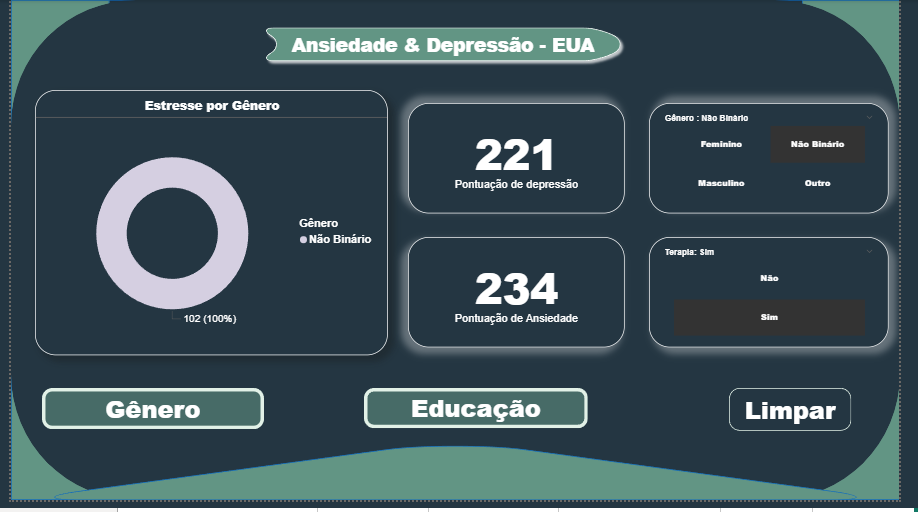

# Projeto Saúde Mental — Power BI  

## Visão Geral  
Este projeto tem como objetivo **analisar dados sobre saúde mental** em diferentes regiões e contextos, utilizando **Power BI** como ferramenta principal de visualização.  
O foco está em compreender os fatores que influenciam o bem-estar mental e como o **trabalho remoto, condições socioeconômicas e culturais** impactam esses indicadores.

---

## Objetivos do Projeto  
- Analisar índices de **ansiedade, depressão e bem-estar** em diversos países.  
- Investigar a **influência do trabalho remoto** na saúde mental.  
- Comparar dados entre **Brasil, EUA e Europa**.  
- Explorar **tendências e correlações** entre variáveis como condição de trabalho, região e gênero.  

---

## Estrutura dos Dados  
Os arquivos utilizados estão armazenados na pasta `/data`:  

| Arquivo | Descrição |
|----------|------------|
| `Dados Ansiedade Depressão - EUA.csv` | Dados estatísticos sobre ansiedade e depressão nos EUA. |
| `Impacto do Trabalho Remoto na Saúde Mental - EUA.csv` | Relação entre trabalho remoto e indicadores de saúde mental. |
| `Saude Mental - Europa.xlsx` | Dados agregados sobre saúde mental em países europeus. |
| `Saude Mental Trabalho - BR.xlsx` | Informações sobre saúde mental e ambiente de trabalho no Brasil. |
| `Saude Mental com Condição - BR.csv` | Indicadores de saúde mental por condições socioeconômicas no Brasil. |

---

## Visualizações  
O dashboard do Power BI apresenta:  
- Tendências de **ansiedade e depressão** por região;  
- Impacto do **trabalho remoto** na saúde mental;  
- Comparativos entre **países, gênero e condição de trabalho**;  
- Insights visuais para apoiar **políticas de bem-estar e gestão de pessoas**.

---

## Principais Insights  
- O **trabalho remoto** apresentou impactos mistos: aumento da flexibilidade, mas também do isolamento em alguns grupos.  
- Países com **maior suporte psicológico e equilíbrio entre vida pessoal e profissional** demonstraram menores índices de ansiedade.  
- Aspectos **sociais e econômicos** seguem sendo determinantes da saúde mental.

---

## Ferramentas Utilizadas  
- **Power BI** — Criação dos dashboards e visualizações.  
- **Excel / CSV** — Estruturação e limpeza dos dados.  
- **GitHub** — Armazenamento e versionamento do projeto.  

---

## Autor  
**Lucas Pdm**  
Estudante de Análise e Desenvolvimento de Sistemas — UNICID  
Apaixonado por dados, tecnologia e projetos que impactam positivamente a sociedade.

---

## Próximos Passos  
- Adicionar novos datasets com foco em **saúde mental pós-pandemia**.  
- Integrar dados do **Brasil e América Latina**.  
- Criar uma **versão online interativa** do dashboard.  

---

*Projeto desenvolvido como parte de estudo e prática em Power BI e análise de dados.*
